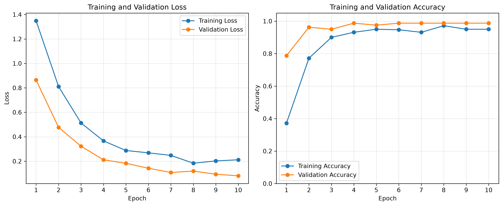
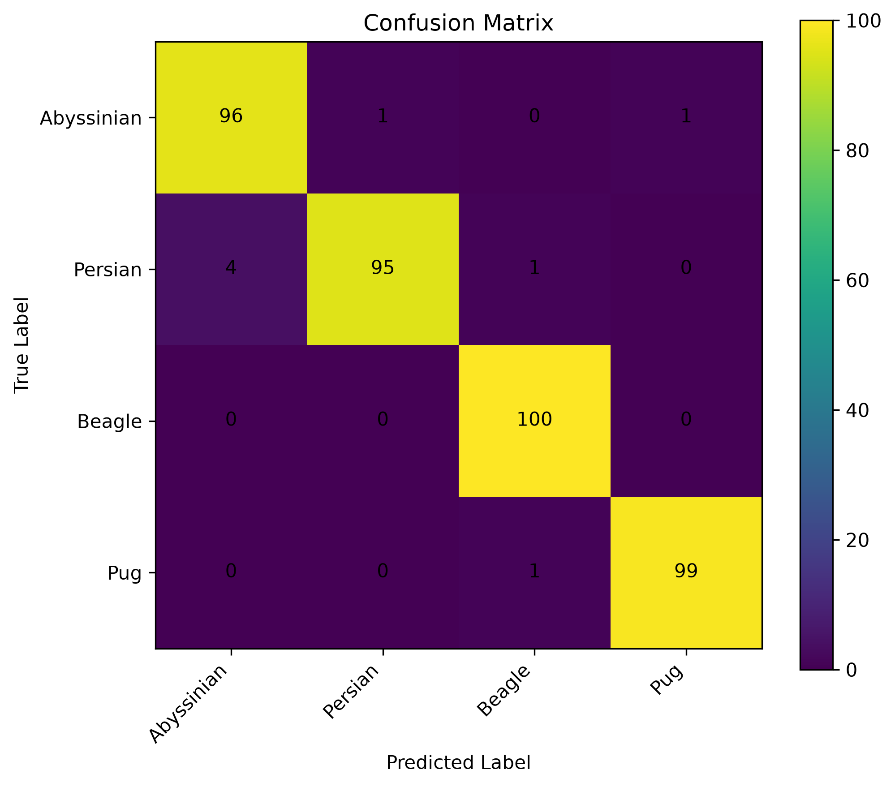
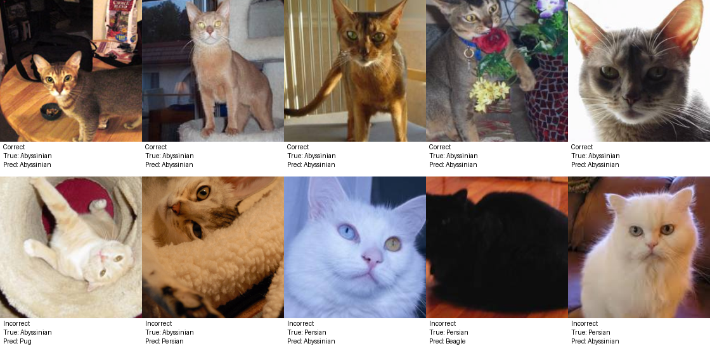

# Computer Vision Thesis Preparation

This project demonstrates my basic practical foundation in computer vision, PyTorch, transfer learning, model evaluation, and video processing.

The main objective is to build and organize a complete image-classification workflow that can be inspected and reproduced before starting a computer vision thesis project.

## 1. Project Pipeline

```text
Dataset
-> Preprocessing and Data Augmentation
-> ResNet18 Transfer Learning
-> Training and Validation
-> Test Evaluation and Error Analysis
-> Frame-level Video Inference
-> CSV Prediction Output
```

## 2. Learning Progress

Before building the final transfer-learning project, two smaller experiments were completed.

### FashionMNIST Baseline

* Configured PyTorch with CUDA support.
* Verified training on an NVIDIA RTX 4070 Laptop GPU.
* Implemented a basic multilayer perceptron training workflow.
* Validation accuracy: **82.65%**
* Test accuracy: **81.64%**

### CIFAR-10 CNN Pipeline

* Built a simple convolutional neural network.
* Created training, validation, and test DataLoaders.
* Implemented separate training and validation loops.
* Saved the model with the best validation accuracy.
* Best validation accuracy: **64.92%**
* Test accuracy: **64.96%**

Additional notes are available in:

```text
notes/training_pipeline.md
```

## 3. Dataset and Methods

### Dataset

The final classifier uses the public Oxford-IIIT Pet dataset.

The repository does not include the downloaded dataset files.

### Selected Classes

Four animal classes were selected:

* Abyssinian
* Persian
* Beagle
* Pug

### Data Split

| Split      | Number of samples |
| ---------- | ----------------: |
| Training   |               320 |
| Validation |                80 |
| Test       |               398 |

### Data Preprocessing

Training images use:

* Random resized cropping
* Random horizontal flipping
* ImageNet normalization

Validation and test images use:

* Resize
* Center crop
* ImageNet normalization

### Model

* Architecture: ResNet18
* Pretrained weights: ImageNet
* Backbone: frozen
* Classification head: replaced with a four-class linear layer
* Trainable parameters: classification head only

### Training Configuration

* Loss function: Cross-Entropy Loss
* Optimizer: Adam
* Learning rate: 0.001
* Batch size: 32
* Maximum epochs: 10
* Random seed: 42
* Model selection: best validation accuracy

## 4. Results

The best ResNet18 model achieved:

| Metric                   |     Result |
| ------------------------ | ---------: |
| Best validation accuracy | **98.75%** |
| Test accuracy            | **97.99%** |
| Macro-F1                 | **97.98%** |
| Weighted-F1              | **97.98%** |

### Class-wise Results

| Class      | Precision | Recall | F1-score |
| ---------- | --------: | -----: | -------: |
| Abyssinian |    0.9600 | 0.9796 |   0.9697 |
| Persian    |    0.9896 | 0.9500 |   0.9694 |
| Beagle     |    0.9804 | 1.0000 |   0.9901 |
| Pug        |    0.9900 | 0.9900 |   0.9900 |

Persian and Abyssinian were the most frequently confused classes. Persian had the lowest recall, while Abyssinian had the lowest precision.

More detailed analysis is available in:

```text
notes/error_analysis.md
```

### Training Curves



### Confusion Matrix



### Prediction Examples



## 5. Video Processing

The project includes a basic frame-level video inference pipeline using OpenCV.

The video component can:

* Open and validate a video file.
* Read its FPS, frame count, resolution, and duration.
* Sample frames using a configurable frame interval.
* Apply the trained ResNet18 model to individual frames.
* Calculate the predicted class and confidence score.
* Save timestamps, frame IDs, predictions, and confidence scores to CSV.

Example CSV format:

```text
timestamp,frame_id,predicted_class,confidence
0.00,0,Abyssinian,0.9404
1.00,25,Abyssinian,0.9352
2.00,50,Beagle,0.8941
```

The generated prediction file is stored at:

```text
results/video_predictions.csv
```

## 6. Project Structure

```text
cv-thesis/
  demo/
    demo_video.mp4

  notes/
    error_analysis.md
    topic2_connection.md
    training_pipeline.md

  project/
    dataset.py
    evaluate.py
    infer_video.py
    make_demo_video.py
    plot_confusion.py
    plot_history.py
    train.py
    utils.py
    video_info.py

  results/
    classification_report.txt
    confusion_matrix.json
    confusion_matrix.png
    sample_predictions.png
    training_curves.png
    training_history.json
    video_predictions.csv

  README.md
  requirements.txt
```

The dataset, Python cache files, local environments, and trained model checkpoints are excluded through `.gitignore`.

## 7. Installation

Python 3.11 is recommended.

Create and activate a clean Conda environment:

```bash
conda create -n cv-test python=3.11
conda activate cv-test
```

Install the required packages:

```bash
python -m pip install -r requirements.txt
```

## 8. How to Run

All commands should be executed from the repository root directory.

### Train the Model

```bash
python -m project.train
```

The best checkpoint is saved locally at:

```text
project/checkpoints/best_model.pth
```

Model checkpoints are excluded from GitHub because they are generated files.

### Evaluate the Model

```bash
python -m project.evaluate --checkpoint project/checkpoints/best_model.pth
```

The evaluation script generates the classification report, confusion-matrix data, and sample-prediction image.

### Generate the Demo Video

```bash
python -m project.make_demo_video
```

### Inspect Video Information

```bash
python -m project.video_info --video demo/demo_video.mp4
```

### Run Frame-level Video Inference

```bash
python -m project.infer_video --video demo/demo_video.mp4 --checkpoint project/checkpoints/best_model.pth --output results/video_predictions.csv --frame-step 25
```

## 9. Reproducibility Test

The project was tested in a separate Conda environment with Python 3.11.15.

The following checks were completed successfully:

* All project modules could be imported.
* Required dependencies were installed from `requirements.txt`.
* CUDA was detected successfully.
* The dataset could be loaded.
* The trained model could perform test-set inference.
* The evaluation results matched the original environment.
* The Demo video could be opened and inspected.
* Frame-level video inference generated a valid CSV file.
* Result images could be opened and displayed normally.

## 10. Limitations and Future Work

This project uses a public pet dataset rather than medical or surgical video data.

The current model performs single-frame image classification. Each sampled frame is processed independently, so temporal relationships between consecutive video frames are not used.

The project does not claim to solve surgical phase recognition. Its purpose is to demonstrate basic practical ability in:

* PyTorch model training
* Transfer learning
* Dataset and DataLoader construction
* Model evaluation
* Error analysis
* OpenCV video processing
* Reproducible project organization

Possible future extensions include:

* Fine-tuning additional ResNet layers
* Using a larger or more domain-relevant dataset
* Handling class imbalance
* Adding confidence calibration
* Using CNN-LSTM models
* Using Temporal Convolutional Networks
* Using video Transformers
* Extending the pipeline to surgical workflow recognition
